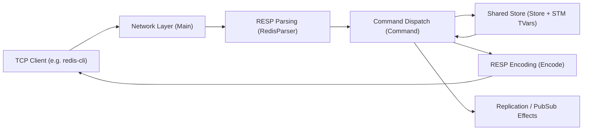

# Redis-Like Server in Haskell

A compact Redis-like server implemented from scratch in **Haskell**.

This project was built as part of the **Codecrafters "Build Your Own Redis"** challenge.
The core focus was clean, maintainable design around the RESP protocol, command parsing, and concurrent client handling.

> [!NOTE]
> This was done for educational purpose only, this is not a production Redis replacement.

## Highlights

- RESP parser + encoder (wire format compatibility for supported commands)
- TCP server with concurrent client handling
- Typed internal command representation (parser -> command AST -> executor)
- STM-backed (Software Transaction Memory) in-memory store using `TVar`s for safe shared state
- Support for replication handshake, Pub/Sub, streams, sorted sets, geospatial commands, and ACL/Auth
- RDB bootstrap loading support via `--dir` and `--dbfilename`

## Supported Commands

- Core: `PING`, `ECHO`, `SET`, `GET`, `INCR`, `TYPE`, `KEYS`
- Lists: `LPUSH`, `RPUSH`, `LRANGE`, `LLEN`, `LPOP`, `BLPOP`
- Streams: `XADD`, `XRANGE`, `XREAD`
- Transactions: `MULTI`, `EXEC`, `DISCARD`
- Replication: `INFO`, `REPLCONF` (`GETACK` included), `PSYNC`, `WAIT`
- Pub/Sub: `SUBSCRIBE`, `PUBLISH`, `UNSUBSCRIBE`
- Sorted sets: `ZADD`, `ZRANK`, `ZRANGE`, `ZCARD`, `ZSCORE`, `ZREM`
- Geospatial: `GEOADD`, `GEOPOS`, `GEODIST`, `GEOSEARCH`
- Auth/ACL: `AUTH`, `ACL` (`WHOAMI`, `GETUSER`, `SETUSER`)
- Config: `CONFIG GET dir`, `CONFIG GET dbfilename`

## Architecture (High Level)



Primary modules:

- `app/Main.hs`: server startup, connection lifecycle, environment initialization
- `app/RedisParser.hs`: incremental RESP command parsing into typed commands
- `app/Command.hs`: command execution and side effects (replication, pub/sub, transactions)
- `app/Store.hs`: shared mutable state abstractions
- `app/Encode.hs`: RESP response encoding helpers
- `app/Replica.hs`: replica handshake and master stream consumption
- `app/RDBParser.hs`: RDB bootstrap file parsing and initial load
- `app/Types.hs`: protocol/domain types and application environments

## Getting Started

### Prerequisites

- `ghc` (recommended via [`ghcup`](https://www.haskell.org/ghcup/))
- `stack`

### Build

```bash
stack build
```

### Run

```bash
stack exec codecrafters-redis-exe -- --port 6379
```

Optional startup flags:

```bash
stack exec codecrafters-redis-exe -- \
  --port 6379 \
  --dir /tmp/redis-files \
  --dbfilename dump.rdb
```

Run as replica:

```bash
stack exec codecrafters-redis-exe -- --port 6380 --replicaof "127.0.0.1 6379"
```

You can also run the convenience script used for local execution:

```bash
./your_program.sh --port 6379
```

### Quick Check

```bash
redis-cli -p 6379 ping
redis-cli -p 6379 set fruit banana
redis-cli -p 6379 get fruit
```

## Project Scope

This project prioritizes clarity and correctness for supported features over complete Redis parity.
It intentionally focuses on protocol handling, concurrency, and modular design rather than production hardening.
